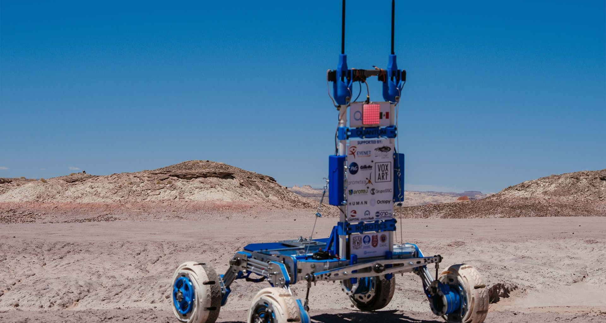

# Navegación Autónoma del Rover

Este proyecto simula la navegación autónoma de un rover en un plano bidimensional utilizando la biblioteca de Python Turtle y el framework simpleai. El objetivo del proyecto es permitir que el rover alcance una ubicación objetivo llamada "ArUco" mientras evita obstáculos en su camino.

## Contenido del Proyecto

El repositorio contiene varios componentes esenciales:

1. **Código de Navegación Básica (Reto_basico.py):** Este código se encarga de la navegación inicial del rover en un entorno simple. Configura el entorno gráfico de Turtle, mueve el rover a una posición inicial, dibuja la ubicación del código ArUco y utiliza un algoritmo simple para navegar hacia él.

2. **Código de Navegación con Obstáculos (Reto_obstaculos.py):** Este código se basa en el código de navegación básica pero introduce obstáculos en el entorno. Implementa un algoritmo que permite al rover evitar obstáculos y alcanzar el código ArUco de manera segura.

3. **Código de Navegación con Algoritmo de Búsqueda (Reto_AI.py):** En este código, se utiliza el framework simpleai para implementar un algoritmo de búsqueda (A*) que permite al rover encontrar la ruta óptima desde su posición inicial hasta el código ArUco. Este código es útil cuando se necesita una solución más eficiente y generalizable para la navegación.

4. **Recursos Gráficos (superficie.png):** Se incluye una imagen de fondo que representa el entorno en el que opera el rover. Esta imagen se utiliza en los códigos de navegación básica y con obstáculos para proporcionar una representación visual del terreno.

## Requisitos

Para ejecutar los códigos proporcionados en este proyecto, asegúrate de tener las siguientes dependencias instaladas en tu entorno de Python:

- Biblioteca Turtle
- Biblioteca math
- Framework simpleai
- Biblioteca colorama (utilizada en Reto_AI.py para resaltar el camino)

## Ejecución

Se pueded ejecutar cada uno de los códigos simplemente ejecutando el archivo Python correspondiente en tu entorno de desarrollo de Python. 

## Personalización

Este proyecto es una base sólida para experimentar con la navegación autónoma de rovers. Se puede llegar a personalizar los códigos, agregar obstáculos adicionales, modificar los mapas o incluso implementar algoritmos de búsqueda más avanzados para adaptarlos a necesidades específicas.

## Créditos

Este proyecto es parte de un ejercicio de aprendizaje y demostración de navegación autónoma utilizando Python. .

Daniela Pamelin Álvarez Guarneros 

Colaborador: Alan Mota Yescas (contribuciones en Reto_AI) 

